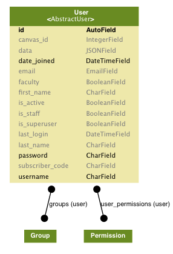

# Wharton SIMPL Users Application

A reusable application to define SIMPL Users

## Getting Started (assumes working in vagrant)

```bash
$ vagrant ssh
$ mkvirtualenv simpl-users
$ add2virtualenv /vagrant/projects/simpl-users
$ cd /vagrant/projects/simpl-users
```

Install requirements:

```bash
$ pip install -r requirements.txt
```

### Running tests with py.test

```bash
$ python runtests.py
```

## Model Schema



